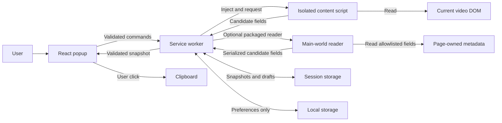
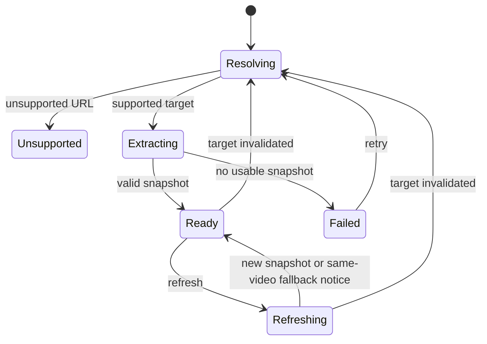

# TubeMeta AI — Architecture

**Version:** 1.0  
**Date:** 2026-10-05  
**Status:** Proposed production design; Phase 0 vanilla JavaScript prototype is in `phase0-prototype/`  
**Requirements:** [PRD v1.1](TubeMeta_AI_PRD.md)  
**Implementation plan:** [TASKS.md](TASKS.md)

## 1. Scope and decisions

Build a Chrome Manifest V3 extension using TypeScript, React, and Vite. The MVP extracts available public metadata from the current supported YouTube page, lets the user edit four content fields, and copies individual fields or the complete record.

The PRD defines product behavior. This document defines implementation boundaries and decisions. Changes to product behavior must also be reflected in the PRD. Browser compatibility and YouTube extraction sources require the Sprint 0 prototype; this design does not claim those have been validated.

| Area | Decision |
| --- | --- |
| Invocation | Extract when the user opens the extension popup |
| Supported hosts | HTTPS `www.youtube.com` and `youtube.com` only |
| Supported routes | `/watch?v=VIDEO_ID` and `/shorts/VIDEO_ID` |
| UI | React popup with component-local state and a feature reducer |
| Extraction | Packaged readers; structured metadata first, verified DOM fallback |
| Coordination | Small background service worker with validated messages |
| Storage | Session snapshots/drafts; local preferences; no sync |
| Permissions | `activeTab`, `scripting`, `storage`; clipboard decision after prototype |
| Build | Separate popup, worker, isolated content script, and main-world reader outputs |
| Backend | None for MVP extraction, editing, or copying |
| Analytics | No remote transport in the initial MVP; use consented beta feedback |
| AI, accounts, payments | Future phase; no inactive AI controls in MVP |

Do not add a state-management framework, database, always-on scraper, or backend to support this scope.

## 2. Runtime boundaries



| Component | Owns | Must not own |
| --- | --- | --- |
| Popup | Rendering, editor state, copy click, save feedback, accessibility | Page scraping or direct writes to persisted drafts |
| Service worker | Request identity, injection, result validation, serialized storage mutations | DOM access, clipboard writes, or durable state solely in globals |
| Isolated content script | Current-video DOM reads, short-lived navigation observation | Draft storage, AI calls, privileged commands from page messages |
| Main-world reader | Minimal synchronous reads of page-owned data when required | Extension APIs, secrets, network requests, or DOM mutation |
| Domain modules | URL validation, field normalization, draft projection, copy formatting | Chrome APIs and React dependencies |
| Storage repository | Key formats, schemas, revisions, quota/failure handling | Rendering or extraction heuristics |

The main-world reader is optional. Prefer readable structured DOM data where adequate. Package any reader function with the extension and pass explicit serializable arguments; an injected function must not depend on its original closure. Obtain its result through the scripting API rather than installing a general page-to-extension command bridge. Treat every result as untrusted. [Chrome scripting API](https://developer.chrome.com/docs/extensions/reference/api/scripting)

## 3. Proposed repository layout

Paths below are planned; creating this document does not create the application scaffold.

```text
TubeMeta/
  TubeMeta_AI_PRD.md
  ARCHITECTURE.md
  TASKS.md
  phase0-prototype/                # Temporary feasibility extension; see docs/feasibility.md
  package.json
  package-lock.json
  tsconfig.json
  vite.config.ts
  popup.html
  public/
    icons/
  src/
    manifest.ts
    background/
      index.ts
      coordinator.ts
      storage.ts
    content/
      index.ts
      navigation.ts
      readers/
        structured-dom.ts
        video-dom.ts
        main-world.ts
    domain/
      metadata.ts
      validation.ts
      youtube-url.ts
      normalize.ts
      hashtags.ts
      drafts.ts
      copy-format.ts
    shared/
      messages.ts
      errors.ts
      limits.ts
    popup/
      main.tsx
      App.tsx
      state.ts
      api.ts
      clipboard.ts
      styles.css
      components/
        VideoSummary.tsx
        MetadataField.tsx
        Details.tsx
        CopyFooter.tsx
        StatusMessage.tsx
  tests/
    unit/
    integration/
    fixtures/
  docs/
    feasibility.md
    source-matrix.md
    validation-report.md
    store-listing.md
    privacy-policy.md
  dist/                         # Generated loadable extension
  release/                      # Generated store package
```

Use npm and commit a single lockfile when scaffolding. Pin compatible dependencies after checking their current requirements. Vite handles popup assets; the build must also emit an MV3 module service worker and a self-contained injectable content script with no unresolved imports or runtime chunk fetching. The main-world reader must survive bundling as a self-contained function. Generate the production manifest from one source of truth and validate all referenced output paths.

Development commands to implement: `dev`, `build`, `typecheck`, `lint`, `test`, and `package`. Package only production extension files; exclude fixtures, source maps containing source content, reports, and development tooling.

## 4. Permissions and execution lifecycle

The provisional manifest contains `manifest_version: 3`, `action.default_popup`, a module `background.service_worker`, icons, and the three permissions in Section 1. It has no static `content_scripts`, persistent `host_permissions`, externally connectable page API, or remote script sources.

`activeTab` provides temporary access following user invocation. It is not a permanent grant or a reason to monitor all tabs. Validate the target hostname and route before every injection. Query the active tab when the popup opens and recheck access on operations that require it. [Chrome activeTab documentation](https://developer.chrome.com/docs/extensions/develop/concepts/activeTab)

Register worker event listeners at startup and hydrate required state inside handlers. Handle worker restarts as normal: recover persisted counters and drafts, abandon uncertain in-flight extraction, and retry through a new request. No keepalive loop is required. [Service worker lifecycle](https://developer.chrome.com/docs/extensions/develop/concepts/service-workers/lifecycle)

Use an idempotent content-script installation guard in its isolated world. While the popup is connected, observe relevant navigation signals and scoped DOM readiness changes. Disconnect active observers when the popup closes, with a bounded lease as a cleanup fallback. An inert responder may remain until document navigation; it must not continue extracting or polling. Reopening establishes a fresh session and verifies the current document.

## 5. Data contracts

Implement the `Field<T>`, `MetadataSnapshot`, and `SessionDraft` contracts from PRD Section 24 in `domain/metadata.ts`, with runtime validation for messages and stored records.

| Value/state | Meaning |
| --- | --- |
| `available` | Reliable value; numeric zero is valid |
| `empty` | Confirmed empty description or list |
| `unavailable` | No reliable source; `value: null` |
| `error` | A reader/parser failed; `value: null` plus a controlled error code |
| `isPartial: true` | Available hashtag matches were derived with incomplete inputs |
| Missing draft override | Use extracted source value |
| Empty draft override | User intentionally cleared the field |

Retain the original snapshot separately from overrides. A derived view model merges them for display/copy and assigns the `Edited` label. Refresh updates the snapshot, not the overrides. Reset deletes overrides, revealing the latest source.

Persist raw duration as seconds, views as an exact integer, publication date as a date-only string, and extraction time as UTC ISO 8601. Keep page route, content type, and playback status separate. Do not infer long-form content from the watch route or classify content solely by duration.

Internal candidate data additionally records the observed video ID, reader identifier, completeness evidence, and field provenance. Candidate data is transient and must not appear in user-facing exports or telemetry. Accept candidates only after validating identity and field schema; do not persist raw page objects.

## 6. Message protocol and request identity

Use a discriminated union with `protocolVersion: 1`. Unknown message types, unsupported versions, and malformed/oversized payloads fail with controlled errors.

| Command/event | Direction | Purpose |
| --- | --- | --- |
| `OPEN_VIDEO` | Popup → worker | Resolve active tab, establish session, load matching draft, extract |
| `REFRESH_VIDEO` | Popup → worker | Request a new source snapshot without deleting overrides |
| `READ_VIDEO` | Worker → content | Read a specific current video under a deadline |
| `VIDEO_INVALIDATED` | Content → worker → popup | Stop using a snapshot after navigation |
| `PATCH_DRAFT` | Popup → worker | Apply one field override and acknowledge persisted revision |
| `RESET_DRAFT` | Popup → worker | Remove specified/all overrides |
| `CLEAR_SESSION_DATA` | Popup → worker | Clear snapshots and drafts; invalidate pending writes/results |
| `VERIFY_COPY_TARGET` | Popup → worker | Recheck current tab/document/video for copy |

Extraction envelopes include `tabId`, `videoId`, monotonically increasing `requestId`, popup session token, document identity when supported, and session data epoch. Store the per-tab request counter in session storage; serialize allocations in the worker. Request ordering is scoped to an epoch, so clearing data can safely reset counters.

Validate extension-page senders separately from content-script senders. For content messages, use the browser-supplied sender tab/frame/document information; do not trust a claimed tab ID in a payload. Restrict readers to the main frame. Commands that mutate drafts must originate from the extension UI, not the content script.

Accept a result only if its epoch, popup session, tab, video, document, and request are still current. Recheck current URL/page identity before committing it. A result from Video A cannot replace Video B; an older A result cannot replace a newer A request after A → B → A.

## 7. Extraction pipeline

1. Parse the current tab URL with `URL`, enforce the exact hostname/route allowlist, validate the video ID, and build a canonical URL without tracking parameters.
2. Allocate a new request envelope. Disable copy until current identity is confirmed.
3. Ensure the isolated reader is installed once in the current document.
4. Read current-video structured DOM candidates. Invoke the packaged main-world reader only where the prototype confirms it is needed.
5. Use verified current-video DOM fallbacks for fields without adequate structured values.
6. Validate source video identity, completeness, field type, size, and safe URL schemes. Derive hashtags and normalized factual fields.
7. Reject stale responses. Commit the snapshot and project matching overrides for display.

Source priority follows PRD Section 8.5. Do not merge fields merely because they are present on the same page. A DOM-only fallback must establish its association with the current video container; an unmatched page title, generic keyword list, recommendation, or inactive Short is insufficient.

Complete descriptions preserve newlines and URLs. Truncated descriptions remain unavailable. Missing tag lists are not proof of an empty list. Hashtags use Unicode-aware parsing, ignore URL fragments, preserve first-seen spelling/order, and use a documented normalization key for duplicate matching. If inputs are incomplete, retain reliable matches as partial; zero matches then means unavailable.

For views, reject abbreviated values as exact counts. For live/upcoming content, reject elapsed playback time as fixed duration and concurrent viewers as total views. Scheduled time is not publication date. Store unknown types honestly.

Retry only readiness/transient conditions within one five-second deadline; use a small bounded retry schedule, not continuous polling. Optional-field failure produces a partial result. Identity failure invalidates the whole result. A result with only a URL does not count as successful extraction.

## 8. Popup state and workflows



`Ready` can contain unavailable/partial fields. Draft saving and clipboard status are independent substates so a save failure does not discard usable extracted content. A same-video fallback is allowed only after fresh identity verification and must show its timestamp and failure notice.

The popup contains a compact summary, four editable metadata cards, a read-only Details section, Refresh, Reset controls, and a sticky Copy Everything footer. Description collapse is presentational. Lists use one token per line in the editor. Show informational character/token counts, edited/partial indicators, keyboard focus, and accessible status announcements.

Do not show cached content until the active tab/video has been resolved. Restore the matching draft after identity checks. Reopening on a different video must not flash the previous video's data.

## 9. Storage, revisions, and cleanup

Use `chrome.storage.session` for snapshots, drafts, and request bookkeeping. It survives ordinary worker suspension but clears on browser restart and extension disable, reload, or update. It is not exposed to content scripts by default; preserve that restriction. Document these expiration conditions in the UI/privacy text. Use local storage only for preferences. [Chrome storage API](https://developer.chrome.com/docs/extensions/reference/api/storage)

Proposed keys:

```text
session: epoch
session: request:<tabId>
session: record:<tabId>:<videoId> -> { schemaVersion, snapshot, draft, revision }
local:   preferences -> { schemaVersion, theme }
```

The worker is the only writer to session records. Serialize mutations through a queue; each handler reads the latest persisted record after hydration and applies a patch. Snapshot commits change only snapshot fields, and draft patches change only overrides. Reject obsolete session tokens/revisions rather than overwriting newer edits. Clear-session is serialized with writes and advances the epoch to block late writes from recreating cleared data.

Send draft patches immediately on accepted input; do not defer the only write until blur, popup close, or a debounce timeout. Show `Saving` until storage acknowledges and `Saved` only afterward. A popup closure after acknowledgement must preserve that edit. Unacknowledged input during a forced process shutdown cannot be promised durable; recover the last acknowledged revision. This is the implementation meaning of the PRD's “last accepted edit.”

On quota pressure, remove replaceable snapshots without overrides first. Never silently evict edited drafts. If saving still fails, keep the current editor usable and show the unsaved warning. Bound input/message sizes without truncating copied content silently; record the limits after the long-description prototype. Clearing session data removes both snapshots and drafts, resets the current editor, and leaves preferences intact.

## 10. Clipboard contract

Keep `projectDraft`, individual-field formatting, and full-record formatting as pure domain functions. Use the exact ordering and headings in PRD Section 11. Omit placeholders, unknown types, and empty fields; preserve zero views and intentional draft overrides. Export source URL/ID and extraction timestamp with all available factual details. Partial extracted hashtags use `HASHTAGS (PARTIAL)`.

On each copy click, request current target verification and immediately write the formatted, verified view through the popup clipboard API. If navigation or a newer request invalidates that view before the write, cancel and re-extract. Do not perform clipboard writes in the service worker.

Asynchronous verification may affect clipboard user activation. Sprint 0 must validate this exact flow on the chosen Chrome baseline. If `clipboardWrite` is required, document and include it; do not replace identity verification with stale cached data. Provide selectable manual-copy text on failure. Show success and record any local success measurement only after the write resolves. Reuse this path for individual copy and Copy Everything.

## 11. Errors and security

Use controlled codes such as `UNSUPPORTED_PAGE`, `ACCESS_DENIED`, `VIDEO_CHANGED`, `PAGE_NOT_READY`, `EXTRACTION_TIMEOUT`, `NO_CORE_METADATA`, `READER_FAILED`, `INVALID_PAYLOAD`, `STORAGE_FAILED`, and `CLIPBOARD_FAILED`.

Map codes to concise user messages. Optional field errors keep other fields usable. Stale responses are discarded without replacing a current successful result. A refresh failure may keep only a verified same-video snapshot. Logs must exclude source content, draft values, raw exception payloads, and clipboard text.

Render metadata as plain text; never use extracted HTML as markup. Validate HTTPS links and thumbnail URLs before use. Package scripts and assets locally; no remote code, `eval`, provider keys, or generic page command bridge. Restrict storage access to trusted extension contexts where applicable. Validate all message boundaries and array/string limits.

MVP makes no extraction API requests and has no analytics transport. Thumbnail display can contact its image host. Inspect release network traffic to confirm this boundary. Future telemetry requires the PRD consent and allowlist design before a transport is introduced.

## 12. Validation and release boundaries

Validation work is planned in [TASKS.md](TASKS.md); none of these checks is complete yet.

| Layer | Evidence required |
| --- | --- |
| Domain | URL allowlist, field states, Unicode hashtags, exact copy output, overrides/reset |
| Integration | Delayed/out-of-order results, navigation epochs, serialized draft writes, worker restart |
| Browser | Watch/Shorts, popup closure, clipboard permissions, storage failures, keyboard behavior |
| Corpus | At least 30 videos; source evidence and expected availability recorded |
| Performance | At least 100 ready-page runs; cold/warm and watch/Shorts reported |
| Release | Loadable production package, minimal permissions, no content uploads, accurate listing |

Apply PRD targets: at least 95% core title/full-description coverage in eligible cases, zero mixed/wrong-video or fabricated-tag results, popup shell p95 ≤300 ms, ready-page extraction p95 ≤2 seconds, bounded loading ≤5 seconds, copy feedback p95 ≤300 ms, and no observed extension-attributable main-thread task over 50 ms in the sample. Record browser/machine details and memory behavior; do not infer passing from a successful build.

## 13. Future extension points

AI will use a separate authenticated backend with usage limits, request deduplication, provider credentials, and consented selected-field input. AI results enter a separate suggestion model and update drafts only on user action. Accounts, payments, persistent history, side panel, bulk analysis, and export files remain outside the MVP build.

Keeping domain logic and storage behind explicit interfaces allows later popup/side-panel reuse without coupling extraction to AI availability.

## 14. Decisions to close during implementation

| Decision | Status | Recorded decision |
| --- | --- | --- |
| YouTube reader sources and selectors | Closed (T002–T004, T011, T020) | Main-world player response is the primary source, validated live on watch and Shorts routes; isolated DOM candidates are fallbacks, and the collapsed description excerpt is explicitly never treated as a complete description; selectors validated against current layouts |
| Minimum Chrome version | Decided with a recorded caveat (T005, T024) | `102` kept as the documented API floor (`chrome.storage.session` availability); validated live on Chrome 153; older versions untested |
| `clipboardWrite` | Closed (T005, T017, T021, T023) | Permission kept: focused-popup writes succeed, an origin-level denial is overridden by the extension permission (observed live), and the unfocused case falls back to manual copy |
| Reader/message size limits | Provisional (T008 closed; T004 sampling open) | 100k chars text / 1k list items / 2k item length / 250k message; bounds reject explicitly and never truncate; the browser long-description ceiling remains unmeasured |
| Retry timing and observer scope | Closed (T013, T019) | 3 attempts with 700 ms spacing inside one 5 s deadline; navigation observer with a 120 s lease, one listener per signal, teardown on stop or expiry |
| Production dependency versions | Closed (T006, T024) | Locked via `package-lock.json` (React 19.3, Vite 8.3, TypeScript 6.0.3, Vitest 5, ESLint 10); worker and content bundles stay unminified so build-time serialization verification remains possible |

If evidence requires a product behavior change, update the PRD, this design, and task acceptance criteria together before marking the affected gate complete.
